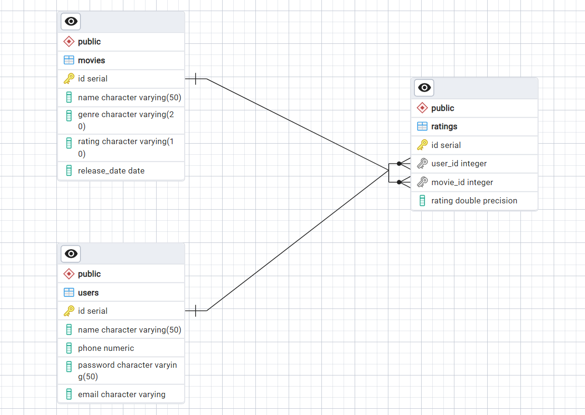
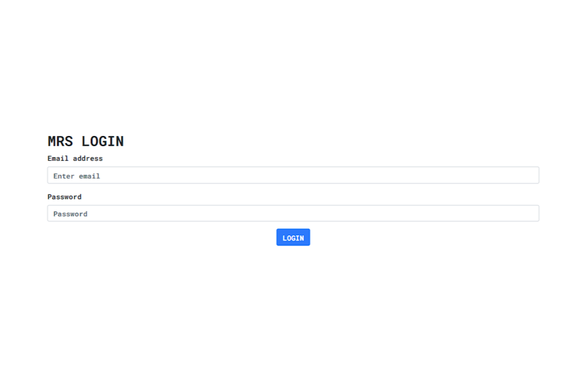
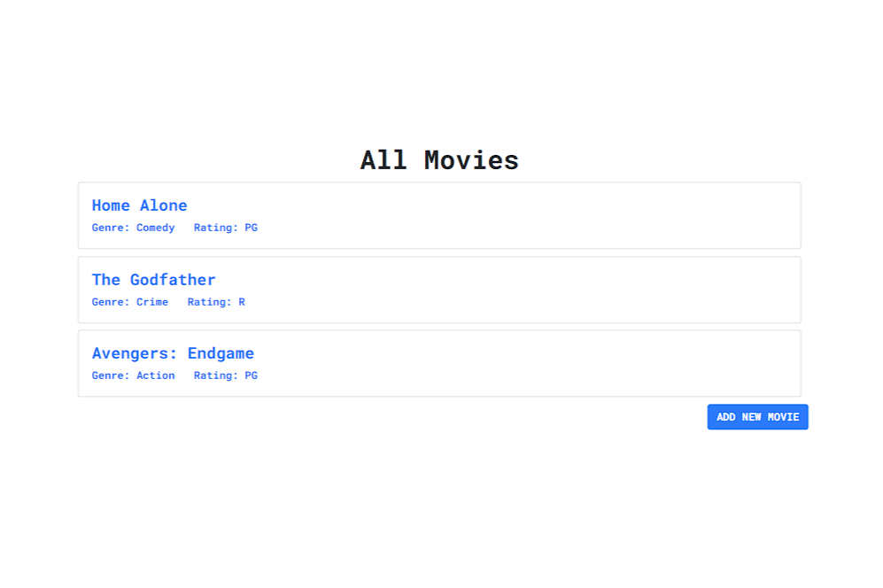
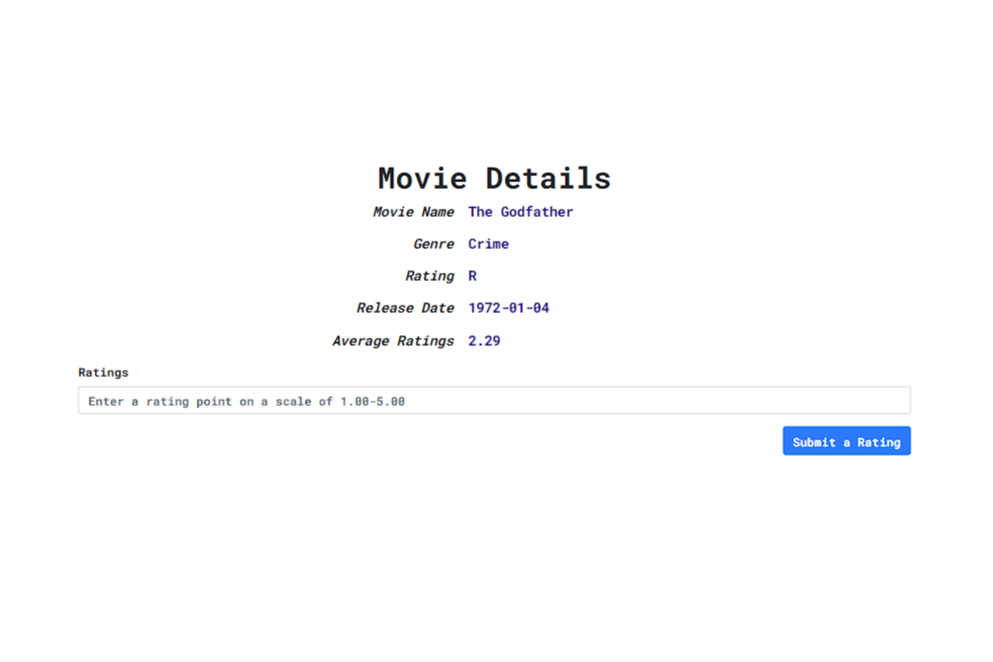
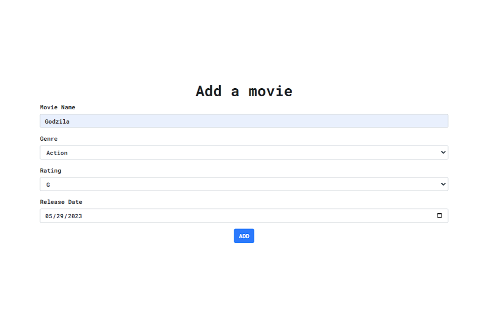

<h1>Movie Rating System</h1>


<h2>Project Development Journal</h2>


<h3><code style="color:blue">Assumptions</code></h3>
<ul>
    <li><strong>A SQL database is already created by an admin.</strong></li>
    <li><strong>The database is deployed on a cloud service server.</strong></li>
    <li><strong>The admin already added some data to the database.</strong></li>
    <li><strong>The operations are designed based on the user-side viewpoint.</strong></li>
    <li><strong>Only the logged in users can perform the operations.</strong></li>
    <li><strong>Unregistered users can't view or perform operations.</strong></li>
    <li><strong>For the limitations in the mentioned requirements, only the selected tasks are designed.</strong></li>
    <li><strong>The given ratings that comes with the movie is given by censor board. It doesn't affect the average ratings.</strong></li>
    <li><strong>I focused mainly on the backend implementation rather than beautifying frontend.</strong></li>
</ul>


<h3><code style="color:blue">Tech Stack</code></h3>
<ul>
    <li><strong>Backend: -</strong><br><pre>Language: Python<br>Framework: Flask</pre></li>
    <li><strong>Frontend: -</strong><br><pre>Language: HTML<br>Styling: CSS, Bootstrap</pre></li>
    <li><strong>Database: -</strong><br><pre>Language: PostgreSQL<br>Server: render.com</pre></li>

</ul>


<h3><code style="color:blue">Folder Structure</code></h3>
<ul>
    <li><strong>bluePrints:</strong> The web application is designed with MVC architecture. There are 3 schemas and those are: user, movies, ratings. This folder contains the model and controller logics with required routes for each of the schema.</li>
    <li><strong>initializations:</strong> This folder contains a notebook. The database was to be initialized with some sample data. so, I created a python notebook and implementing necessary logics, I inserted the given data to the database.</li>
    <li><strong>static:</strong> It containes a css file is used to customize html pages.</li>
    <li><strong>templates:</strong> It contains all the html files to be rendered.</li>
    <li><strong>app.py:</strong> The main Python file where I defined and configured the flask application.</li>
    <li><strong>assets:</strong> It contains images that are used to describe tasks in README.md.</li>
</ul>

<h3><code style="color:blue">Entity Relationship Diagram</code></h3>
<div align="center">
    
</div>

<h3><code style="color:blue">Webpages</code></h3>
<h4>Login Screen</h4>
<div align="center">
    
</div>
<h4>View All Movies</h4>
<div align="center">
    
</div>
<h4>Movie Details and Give Ratings</h4>
<div align="center">
    
</div>
<h4>Add New Movie</h4>
<div align="center">
    
</div>

<h3><code style="color:blue">How to use</code></h3>

1. <strong>Clone the repo</strong>
```
git clone https://github.com/Neloy-Barman/Movie-Rating-System.git
```
2. Create & activate virtual Environment
```
virtualenv --no-site-packages venv
source venv/bin/activate
``` 
3. Install dependencies
```
pip install -r requirements.txt
```
4. Run the application
```
flask run 
or 
python app.py 
```

